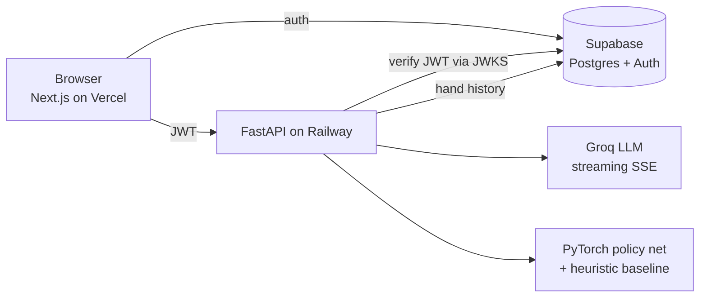

# RiverIQ

A Texas Hold'em training platform: play against AI opponents with distinct playing styles, get real-time coaching from an LLM that can see your exact spot, and review your hand history for statistical leaks.

**Live demo:** [river-iq-omega.vercel.app](https://river-iq-omega.vercel.app) — sign up with any email, no verification required.

---

## What it does

- **Play** a full 5–9 handed no-limit table against bots with eight distinct personalities (nit, TAG, LAG, calling-station, maniac, home-game, pro, GTO-wizard), each with its own opening ranges, c-bet frequencies, bluff rates, and sizing.
- **Ask the coach** mid-hand or after showdown. It receives your hole cards, the board, the full action history, opponent stacks and archetypes, plus precomputed equity, pot odds, and SPR — then streams advice token by token.
- **Review your game.** Every hand is persisted and aggregated into standard poker metrics, with a leak detector that flags stats falling outside healthy bands.

## Architecture



The game engine runs client-side, so play stays responsive with no network round-trip per action. The backend owns bot decisions, equity, coaching, and persistence.

| Layer | Technology |
|---|---|
| Frontend | Next.js 16 (Turbopack), React, TypeScript, Tailwind → Vercel |
| Backend | FastAPI, Python 3.12 → Railway |
| Database & auth | Supabase (Postgres + Supabase Auth) |
| LLM | Groq — `openai/gpt-oss-120b`, streamed over SSE |
| Bot policy | PyTorch MLP blended with a heuristic baseline |
| Equity | `treys` + Monte Carlo simulation |

## Engineering highlights

**Learned bot policy.** A PyTorch network maps a 73-dimensional feature vector (hole-card strength, board texture, pot geometry, position, street, stack depth, opponent count, personality one-hots) through a 128→128→64 MLP into two heads: action logits and a continuous bet-sizing output. It's trained with cross-entropy on actions plus a masked regression loss applied only to raise labels, since sizing is undefined for folds and checks. Illegal actions are masked at inference from the live game state. Each personality carries a `policy_weight`, and the orchestrator makes a Bernoulli draw per decision to blend the network against the rule-based baseline — so the table has variety, and the app degrades gracefully to pure heuristics when no checkpoint is present.

**Side-pot resolution.** Pots are reconstructed from each player's total contribution rather than a single running total. Every distinct contribution level forms a layer funded by all players who reached it (folded players' chips included as dead money), but winnable only by those still live. Uncalled overbets fall out of the same algorithm as a single-eligible top layer and return to the bettor automatically. Odd chips are distributed deterministically by seat.

**Authentication.** Supabase issues ES256-signed JWTs. The backend verifies them against the project's JWKS endpoint with the key selected by the token's `kid`, and pins the issuer. The verified `sub` claim becomes the `user_id` for every database write — the client can't assert an identity, so cross-user data access is structurally impossible rather than merely prevented by a check.

**Resilient LLM integration.** The coach streams SSE via `fetch` + `ReadableStream` (rather than `EventSource`, which can't POST a body). The model id, fallback model, and provider base URL are all environment-driven, and the client fails over automatically on 404 (model retired) or 429 (throttled) — failover happens on the initial request, before any token is yielded, so a streaming reader never sees a half-written reply restart.

**Statistics engine.** VPIP, PFR, 3-bet, fold-to-3-bet, flop c-bet, WTSD, W$SD, and per-street aggression factor, each paired with the denominator that produced it so a 4-for-4 c-bet sample is visibly distinguishable from a 40-for-40 one. Leak detection compares each metric against a healthy band and suppresses judgment entirely below a minimum sample size.

**Production hardening.** Per-route IP rate limiting (`slowapi`) with `X-Forwarded-For` awareness, Pydantic payload bounds on every field, env-driven CORS, security headers on all responses, a per-user row ceiling, and a scheduled GitHub Action that pings the database to prevent the free tier from idling into a paused state.

## API

| Method | Endpoint | Purpose |
|---|---|---|
| `POST` | `/bot/decide` | Bot action for a given spot |
| `POST` | `/equity/calculate` | Multi-way equity via Monte Carlo |
| `GET` | `/equity/hero` | Hero equity vs. N random hands |
| `POST` | `/coach/chat` | Coach reply (blocking) |
| `POST` | `/coach/chat/stream` | Coach reply (SSE stream) |
| `POST` | `/history/hand` | Persist a finished hand |
| `GET` | `/history/hands` | Recent hands |
| `DELETE` | `/history/hands` | Clear history |
| `GET` | `/history/stats` | Aggregated statistics |
| `GET` | `/history/leaks` | Leak analysis |
| `GET` | `/health` | Liveness + database reachability |

Interactive docs at `/docs` when running locally.

## Local development

**Prerequisites:** Python 3.12+, Node.js 18+, and accounts with [Supabase](https://supabase.com) and [Groq](https://console.groq.com) (both have free tiers).

**Backend**

```bash
cd backend
pip install -r requirements.txt
uvicorn app.main:app --reload
```

Runs at `http://localhost:8000`.

**Frontend**

```bash
cd frontend
npm install
npm run dev
```

Runs at `http://localhost:3000`.

## Configuration

Copy `.env.example` to `.env` in the project root:

```bash
GROQ_API_KEY=                  # console.groq.com
SUPABASE_URL=                  # Supabase → Settings → API
SUPABASE_ANON_KEY=
SUPABASE_SERVICE_ROLE_KEY=     # backend only, never exposed to the browser
SUPABASE_JWT_SECRET=           # only needed for legacy HS256 tokens
CORS_ALLOW_ORIGINS=http://localhost:3000

# Optional — override to swap models without a code change
# GROQ_MODEL=openai/gpt-oss-120b
# GROQ_FALLBACK_MODEL=groq/compound-mini
# GROQ_BASE_URL=               # any OpenAI-compatible provider
```

The frontend reads its own `frontend/.env.local`:

```bash
NEXT_PUBLIC_API_BASE=http://localhost:8000
NEXT_PUBLIC_SUPABASE_URL=
NEXT_PUBLIC_SUPABASE_ANON_KEY=
```

Database schema lives in `backend/db/`; run the `.sql` files in the Supabase SQL editor.

## Training the policy network

The shipped checkpoint (`backend/ml/saved_models/policy_v1.pt`) is loaded at startup. To regenerate it:

```bash
cd backend
python -m ml.generate_training_data --n 200000 --out ml/data/train.npz
python -m ml.train_policy --data ml/data/train.npz \
    --out ml/saved_models/policy_v1.pt --epochs 15
```

Without a checkpoint the orchestrator falls back to the heuristic baseline, so the app runs either way.

## Project layout

```
backend/
  app/
    bots/         policy network, heuristic baseline, personalities, features
    coach/        LLM client, prompt construction, game-context builder
    history/      Supabase client, statistics, leak detection
    routers/      FastAPI endpoints
    auth.py       JWT verification against Supabase JWKS
  db/             SQL schema and migrations
  ml/             training-data generation and the training loop
frontend/
  app/            routes (game, history, stats, sign-in)
  components/     table, seats, cards, action panel, coach panel
  lib/            game engine, hand evaluation, API clients, auth context
```

## License

MIT
